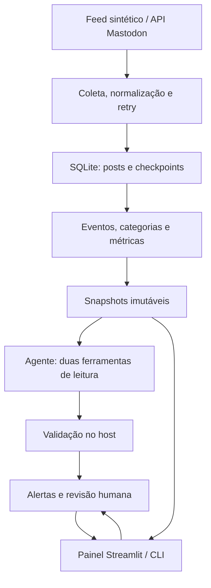

# Arquitetura do SMILE

## Pipeline local

O núcleo usa Python e SQLite para tornar a execução local simples e inspecionável;
Streamlit atende à revisão mínima pedida. Não há necessidade de hospedar a solução.
Coleta/score não dependem de LLM. Uma análise determinística continua disponível
quando não há credencial ou o provedor falha, com identificação explícita do modo.

## Identidade, tempo e consistência

- Posts: chave `(platform, post_id)`, URI canônica quando disponível, conteúdo original
  e `timestamp`/`collected_at` distintos. IDs e autores Mastodon incluem a instância.
- Página e checkpoint: mesma transação SQLite. O feed local usa cursor numérico e hash
  do prefixo já consumido. Alteração/truncamento exige fonte/banco isolado.
- Cobertura: manifesto de fixture sintético verificado por SHA-256. Só se torna completa
  após EOF sem rejeições. APIs públicas e streams permanecem amostras parciais.
- Janelas: intervalos UTC semiabertos `[start,end)`, com comparação temporal SQLite;
  apenas a última janela fechada e três anteriores. Ausência de cobertura é desconhecida.
- Evento: entidade/ação por regras lexicais, ID estável entre rodadas. Alternativas
  lexicais agrupam as paráfrases demonstradas; ação separa listagem de incidente.
- Snapshot: tópico, janela, versão, fingerprint de métricas/evidências e classificação.
  A atualização de métricas atuais e do snapshot é atômica. O histórico é imutável.
- Alerta: vinculado ao snapshot; cache de análise/LLM por versão/modelo/política.
  Retry de LLM cria tentativa adicional. O painel só une um alerta às métricas da
  mesma janela e versão, preservando registros antigos.
- Revisão: eventos humanos em tabela separada, com autor, data e resumo editado.
  Aprovação anterior não se propaga para nova evidência/versão.

## Limites do agente e critic

São permitidas somente `get_topic_metrics` e `get_topic_evidence`, ligadas ao candidato
atual. Ambas são obrigatórias; chamadas ficam em `agent_calls`. Limites: quatro chamadas
ao modelo, seis chamadas a ferramentas, uma reparação, oito posts por consulta,
1.800 caracteres por post, 25 segundos por request, resposta de até 256 KiB.
A consulta de evidências prioriza instrução maliciosa, autoridade sintética e negação,
para que os casos difíceis cheguem ao agente.

O host valida estrutura, referências realmente consultadas e trechos literais.
Texto literal observado prova o que um post contém, não que o evento ocorreu.
`confirmed_in_simulation` exige autoridade rotulada dentro do fixture sintético;
não se aplica a posts reais. Resumo principal usa métricas confiáveis; interpretação
livre do modelo fica separada e não verificada. O modelo não publica nem controla SQL,
shell, arquivos ou URLs. Prompt injection continua sendo uma limitação de interpretação
semântica; a allowlist é a barreira executável para ações indevidas.

## Circulação e próximos métodos

O HHI mede concentração de contribuições por autor no recorte. O sistema mostra
origens declaradas e sua cobertura, origem conhecida da afirmação excluindo textos de
negação, mínimo observado de reposts e conteúdo repetido. Independência e localização
ficam desconhecidas; dois autores ou dois links não comprovam duas fontes independentes.
A proporção total de reposts não é estimada quando os vínculos faltam.

Comunidades e contas ponte exigem arestas explícitas de resposta, repost e menção,
com identificadores canônicos e tempo. A evolução seria um grafo temporal por janela,
com detecção de comunidades e identificação das contas que conectam grupos.
Narrativas concorrentes exigem agrupar afirmações/posições e acompanhar mudanças entre
versões, preservando negações e correções. Diferenças regionais só seriam calculadas
com localização sustentada e sua cobertura; idioma não comprova região. Essa evolução
é um desenho, não uma funcionalidade entregue.

## Evolução para dez milhões de posts/dia

Dez milhões/dia equivalem a cerca de 116 posts/segundo em média. Pico hipotético de
10 vezes: aproximadamente 1.160/s. Esses números não são throughput medido do MVP.

1. Conectores por fonte com orçamento próprio, paginação/backfill, checkpoint durável
   e filas com retries/atraso; erros persistentes para uma fila de investigação.
2. Workers de normalização/deduplicação particionados por identidade. Retenção e
   armazenamento de evidências definidos por fonte/contrato e janela de interesse.
3. Índices de candidatos por entidade/tempo/ação para clustering; comparar blocos,
   evitando todos os pares. Introduzir embeddings apenas quando seu custo/qualidade
   superarem as regras para o domínio observado.
4. Agregados incrementais por janela e tempo do evento, com watermark para atrasos,
   correções de janelas e invalidação de snapshots/cache por nova evidência.
5. PostgreSQL ou armazenamento equivalente para metadados/revisões; armazenamento
   particionado para o volume de posts. SQLite permanece apenas no protótipo local.
6. Enviar ao LLM somente candidatos relevantes, amostras limitadas e métricas agregadas.
   Deduplicar jobs por tópico/janela/versão e cachear análises. Não enviar dez milhões
   de posts individualmente a um modelo.
7. Monitorar atraso da fila, idade da última coleta, cobertura por fonte/janela,
   429/erros, registros rejeitados, campos ausentes, duplicação, mudanças de agrupamento,
   referências inválidas, correções humanas, latência e custo por alerta.

O coletor JSONL atual lê o fixture em memória a cada página e o agrupador varre quatro
janelas; isso é aceitável para a demo, não para escala. A arquitetura proposta exige
processamento incremental e testes de carga. Paginação REST histórica e SSE amostrado
não garantem captura sem perda; backfill/reconciliação por fonte são necessários.

## Custos com premissas explícitas

**Todos os preços abaixo são hipotéticos**, não cotações de OpenRouter ou cloud.

| Premissa | Valor ilustrativo |
|---|---:|
| Volume ingerido | 10.000.000 posts/dia |
| Candidatos enviados ao LLM | 100/dia |
| Tokens de entrada por candidato, somando rodadas | 6.000 |
| Tokens de saída por candidato, somando rodadas | 1.000 |
| Preço de entrada | US$1/milhão de tokens |
| Preço de saída | US$3/milhão de tokens |

`100 * (6.000*1/1.000.000 + 1.000*3/1.000.000) = US$0,90/dia`.
Com margem hipotética de 20% para retries: US$1,08/dia, ou US$32,40 em trinta dias.
Com 1.000 candidatos/dia, esse componente seria dez vezes maior. O orçamento deve
contar o histórico reenviado em cada rodada de ferramenta, não só o texto inicial.

Para dimensionar armazenamento, assuma hipoteticamente 2 KiB normalizados/post:
aproximadamente 20,5 GB/dia, 614 GB em trinta dias antes de índices, réplicas e backup.
A US$0,03/GB-mês, somente os 614 GB custariam cerca de US$18,42/mês.
Filas/workers/banco/tráfego podem ter reserva ilustrativa de US$300/mês, levando a
US$350,82/mês nesses componentes. Essa reserva não comprova capacidade; coleta e
licenças de dados, embeddings, observabilidade e suporte estão excluídos. Um orçamento
real exige medição do tamanho dos posts, candidatos, tokens, retenção, pico e contratos.
