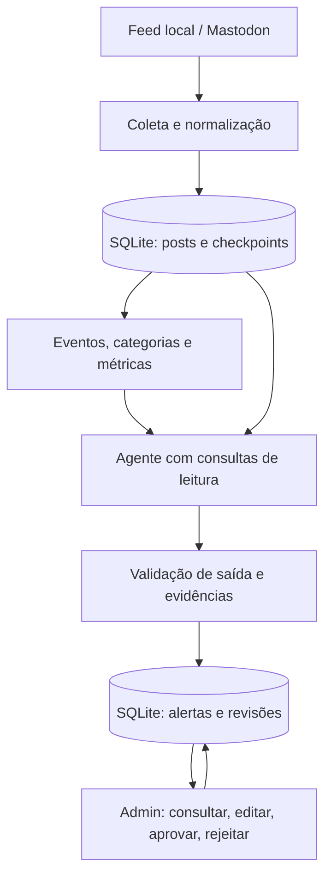

# Plano técnico — CryptoBR Social Intelligence

Planejamento de 06/10/2026, baseado nas seis páginas do desafio fornecidas. Este arquivo define a implementação; não representa um protótipo já executado. Orçamento: quatro horas de implementação e aproximadamente vinte minutos de apresentação.

## 1. Resultado a entregar

Um protótipo local que consome um feed paginado, identifica eventos em crescimento, organiza os assuntos em até cinco categorias, calcula métricas explicáveis, consulta evidências por um agente e registra sugestões para revisão humana. Os assuntos e seus rankings são atualizados com novas coletas. A demonstração deve funcionar com um dataset sintético identificado, sem depender do acesso às redes sociais.

Prioridades conforme o enunciado:

| Critério | Peso | Evidência na entrega |
|---|---:|---|
| Tendências e comparação com referência | 30% | Ranking por volume e por score, componentes e inversão de posição |
| Coleta, normalização e confiabilidade | 20% | Paginação, checkpoint, reexecução idempotente, falha e retry limitado |
| Circulação e concentração | 15% | HHI, autores, famílias de conteúdo e origens observadas |
| IA, evidências e incerteza | 15% | Agente consultando ferramenta, referências válidas e rumor monitorado |
| Arquitetura, custos e escala | 15% | Evolução incremental e estimativa com premissas explícitas |
| Reprodução e documentação | 5% | Seed, relógio fixo, comandos, dependências e resultados exportados |

## 2. Escopo e stack

**Implementar:** Python 3.11 ou superior, Pydantic, httpx, scikit-learn, SQLite via biblioteca padrão, Streamlit e pytest para as verificações críticas. Um processo de pipeline, uma interface administrativa e um agente. Os módulos compartilham funções de domínio e o repositório.

**Conector obrigatório:** feed JSONL local com paginação, cursor e falha transitória controlada. Isso é permitido explicitamente no desafio. Não basta ler o arquivo todo e chamar isso de paginação: o consumidor precisa pedir páginas, persistir progresso e retomar.

**Conector externo opcional:** Mastodon por hashtag, em uma instância cujo acesso seja permitido. Implementar somente após o fluxo obrigatório funcionar. Configurar `MASTODON_BASE_URL`, `MASTODON_TOKEN` opcional e uma lista pequena de hashtags. Nunca presumir cobertura global.

**Adiar:** FastAPI, Docker, múltiplas plataformas, GDELT, embeddings com download de modelos, autenticação do admin, microsserviços, Kafka e análise completa de comunidades. Esses itens podem aparecer na evolução documentada. Scraping HTML entra posteriormente como outro adaptador; não é necessário para cumprir o teste.

### 2.1. Avaliação do Agent-Reach

Repositório indicado: [Rukafuu/Agent-Reach](https://github.com/Rukafuu/Agent-Reach). Revisão estática do README, `core.py`, base dos canais, canais de Twitter/RSS/Web, referências sociais e dependências; sem instalação ou teste de conectividade no Mac.

**Decisão:** opção para descoberta/leitura de evidências complementares, após o núcleo funcionar. Manter feed local como caminho reproduzível e Mastodon como conector social opcional. Não acrescentar o pacote inteiro apenas para ler RSS: o backend indicado é `feedparser`, que pode ser usado diretamente.

O núcleo é uma camada de instalação, configuração e diagnóstico. Muitas leituras são delegadas a CLIs e serviços externos. Ele não fornece, nos contratos revisados, o nosso modelo comum de posts, janelas, persistência de checkpoints ou ranking. Algumas integrações têm métodos próprios, como `WebChannel.read`, mas isso não equivale a uma API uniforme de coleta social.

| Integração | Utilidade no teste | Limite documentado |
|---|---|---|
| Web / Jina Reader | Ler página pública de evidência previamente selecionada | Retorna texto; timestamps, autoria e suporte à afirmação ainda precisam ser preservados/validados |
| RSS / feedparser | Consumir anúncios ou notícias complementares | Precisa do nosso adaptador; canal do Agent-Reach verifica disponibilidade da biblioteca |
| X / twitter-cli e OpenCLI | Eventual amostra social, se acesso permitido e já configurado | Dependência de credenciais/sessão; documentação indica busca possivelmente instável |
| Instagram / OpenCLI | Posts recentes de usuários conhecidos | Busca documentada é de usuários, sem promessa de busca global de posts por hashtag |

Se adotado, criar um `EvidenceEnricher` separado do cálculo de tendências: recebe referências de fontes escolhidas, preserva URL e conteúdo obtido, distingue data de coleta e publicação quando conhecida e salva evidências para consulta pelo agente. Resultado de pesquisa não estabelece cobertura temporal nem confirmação independente automaticamente. O agente de análise continua sem shell e sem permissão para instalar ferramentas.

As rotas que reutilizam sessão/cookies precisam ser avaliadas contra a regra de acesso permitido do desafio. A disponibilidade técnica de uma ferramenta não demonstra autorização nem permissão para contornar autenticação, rate limits ou anti-bot. Não depender dessas rotas na primeira entrega.

Fontes da avaliação: [núcleo](https://github.com/Rukafuu/Agent-Reach/blob/main/agent_reach/core.py), [canal web](https://github.com/Rukafuu/Agent-Reach/blob/main/agent_reach/channels/web.py), [canal RSS](https://github.com/Rukafuu/Agent-Reach/blob/main/agent_reach/channels/rss.py) e [referências sociais](https://github.com/Rukafuu/Agent-Reach/blob/main/agent_reach/skill/references/social.md).

### 2.2. Cinco categorias com assuntos atualizados

As categorias são fixas e configuráveis no MVP; os eventos dentro delas são descobertos e atualizados pelo pipeline. Limite de cinco categorias ativas. Não criar novas categorias automaticamente a cada notícia.

| ID estável | Categoria | Recorte inicial |
|---|---|---|
| `crypto_web3` | Cripto e Web3 | Bitcoin, Ethereum, tokens, DeFi, stablecoins, protocolos e segurança blockchain |
| `investments_markets` | Investimentos e Mercados | ETFs, bolsa, câmbio, juros, inflação e decisões econômicas com impacto nos mercados |
| `politics_regulation` | Política e Regulação | Regras para cripto, tributação, fiscalização e decisões políticas com relação financeira explícita |
| `business_finance` | Empresas e Finanças | Exchanges, bancos, fintechs, resultados, captação, aquisições, insolvência e pagamentos |
| `sports_entertainment` | Esportes e Entretenimento | Fan tokens, NFTs, patrocínios cripto e negócios financeiros de clubes, ligas e entretenimento |

Esportes e política entram pelo vínculo com cripto, investimento ou finanças. Resultado de partida, fofoca e disputa partidária sem esse vínculo ficam fora do recorte. Uma hashtag genérica, como `#politica`, pode servir à descoberta, mas não basta para elegibilidade nem para classificação. Preferir consultas específicas por categoria e verificar o conteúdo recuperado.

**Categoria e evento são conceitos separados.** “Exchange anuncia listagem” e “exchange sofre incidente” são eventos diferentes, mesmo em Empresas e Finanças. “Regulador autoriza um ETF cripto” pode ter categoria principal Política e Regulação e secundária Investimentos e Mercados, preservando um único `topic_id`.

Classificação inicial: regras determinísticas com aliases, expressões e contexto do domínio, depois do agrupamento por evento. Cada tópico recebe uma categoria principal e, quando sustentada, no máximo uma secundária. Configuração versionada em `config/themes.json`, contendo ID, nome, descrição, termos, consultas e regras de prioridade. Empates usam prioridade explícita da configuração; se não houver suporte suficiente, deixar categoria `null` para revisão, sem inventar uma sexta categoria “Outros”.

Guardar `primary_category`, `secondary_categories`, `classification_method`, `classification_reason`, `taxonomy_version`, `first_seen_at`, `last_seen_at` e `updated_at` no tópico. Classificação heurística não precisa de chamadas adicionais de LLM por post. A categoria pode mudar com novos dados ou correção humana; preservar a versão anterior e registrar o motivo. Uma correção manual prevalece até ser removida explicitamente.

**Atualização dos assuntos:** em cada rodada, coletar desde o checkpoint, associar novas publicações a eventos existentes ou criar eventos novos, recalcular janelas afetadas e atualizar a versão do tópico. Um evento mantém seu ID entre rodadas; não substituir o ID apenas porque seu título, categoria ou redação mudou. Nesta demo, usar uma chave canônica de evento e consulta aos tópicos existentes; documentar a limitação da associação lexical.

Planejar modo local `--watch` com intervalo configurável, inicialmente sessenta segundos, respeitando o limite de cada fonte. Atualizar o painel após cada rodada e mostrar `last_successful_collection_at`, `updated_at`, janela analisada e cobertura. O modo reproduzível roda por comando/avanço de lote com relógio fixo. São modos distintos de execução do produto; não dependem de um agendamento externo.

Novos posts aparecem no painel, mas a pontuação final continua baseada nas janelas completas da seção 6. A janela em andamento é identificada como parcial; não compará-la diretamente com uma janela histórica completa nem anunciar crescimento conclusivo a partir dessa comparação. Falha de coleta mantém os últimos dados e mostra atraso, sem apresentar a tela antiga como atualizada.

Ranking global contém cada `topic_id` uma vez. Na navegação por categoria, um evento com classificação secundária pode aparecer em duas listas, usando o mesmo score e referências. Totais globais são calculados por IDs distintos; não somar contagens das categorias sobrepostas. O score não recebe bônus por categoria e a comparação com volume usa exatamente o mesmo filtro.

Quando novas evidências mudarem a recomendação, gerar uma nova versão de alerta em revisão pendente; manter a decisão humana sobre a versão anterior. Um rumor posteriormente confirmado por evidência pode passar de acompanhamento para destaque, sem apagar o contexto anterior.

## 3. Arquitetura do protótipo



O score é calculado em Python e fica preservado. O agente interpreta sinais e afirmações, mas não redefine números nem publica conteúdo. A validação pode bloquear a sugestão ou limitar sua recomendação. A decisão humana é registrada separadamente.

## 4. Contratos de dados e coleta

`Post`: `post_id`, `platform`, `timestamp` de publicação, `collected_at`, `content`, `author_id`, `source_url` ou referência local, `likes`, `comments`, `reposts`, `views`. Campos adicionais: `canonical_uri`, `repost_of`, `cited_source`, `event_published_at`, `content_hash`, `content_family_id`, `topic_id` e `is_synthetic`.

- Datas timezone-aware, persistidas em UTC; nunca usar a coleta como data da publicação.
- Métricas ausentes permanecem `null`. Registrar a cobertura dos campos.
- Preservar o texto original e uma versão normalizada; remover HTML de texto vindo do Mastodon.
- Identificadores de autor precisam incluir namespace da plataforma/instância. Usar URI canônica quando disponível; não unificar pessoas entre plataformas sem evidência.
- `event_published_at` só existe quando fornecido ou sustentado pela evidência. Sem ele, a idade do evento é desconhecida.

Contrato do coletor: `fetch_page(query, cursor) -> {items, next_cursor, exhausted, coverage}`. A consulta e a configuração fazem parte da identidade do checkpoint.

Persistir os posts da página e seu novo checkpoint **na mesma transação**. Uma falha antes do commit reprocessa a página; a restrição única de identidade do post impede novas contagens. Dados inválidos devem ser registrados com erro e payload suficiente para inspeção antes de avançar o cursor.

Retry: no máximo três tentativas por página para timeout, HTTP 429 ou 5xx; backoff limitado e `Retry-After` quando disponível. Em 401/403, parar e informar a limitação de acesso. Em orçamento de retry esgotado, manter o último checkpoint confirmado. Paginação precisa detectar cursor repetido e impor limite de páginas.

Demo de confiabilidade: coletar uma página; provocar uma falha transitória na seguinte; mostrar o retry; interromper após outro commit; retomar; reexecutar tudo e demonstrar que o total de posts não aumenta. A falha controlada é identificada como simulação.

Mastodon: `GET /api/v1/timelines/tag/{hashtag}`; paginação por `max_id`/links retornados, mantendo checkpoint por hashtag e instância. O endpoint pode exigir autenticação conforme a configuração do servidor. Testar uma requisição legítima e não contornar restrições. API vazia ou bloqueada não é ausência de discussão.

## 5. Deduplicação e agrupamento por evento

São três operações diferentes:

1. **Identidade de ingestão:** o mesmo post recebido novamente não gera outra linha nem outra menção.
2. **Família de conteúdo:** posts distintos com texto copiado ou quase copiado permanecem armazenados, associados a uma família. Eles são úteis para medir circulação.
3. **Evento:** redações diferentes sobre o mesmo acontecimento pertencem ao mesmo tópico. Semelhança textual não equivale a origem independente.

Normalização conservadora: Unicode, caixa, espaços e aliases de domínio, preservando datas, números e negações. Hash de texto para cópias exatas. Para quase cópias, TF-IDF com n-grams e similaridade, avaliando candidatos dentro de um bloco de entidade e tempo.

Para eventos, combinar aliases de entidades com ação/objeto: `BTC/Bitcoin + ETF + aprovação` e `Binance + invasão/ataque/hack`. Agrupar redações compatíveis usando similaridade dentro desses blocos. `Binance + listagem` deve permanecer separado de `Binance + invasão`.

Os limiares são parâmetros de uma heurística lexical, ajustados pelos pares positivos e negativos do dataset; não são garantias semânticas universais. Preservar negações e qualificadores: afirmações contraditórias sobre o mesmo rumor podem pertencer ao mesmo evento e precisar de uma flag de contradição. Conteúdo ambíguo fica sem associação ou exige revisão.

Limitação assumida: o MVP é ajustado a vocabulário de cripto e um evento principal por post. Sinônimos fora do dicionário, sarcasmo, múltiplos idiomas e posts com vários eventos podem falhar. Registrar esses casos; evolução possível com embeddings e validação de pares, sem trocar similaridade por prova de veracidade.

**Não usar rótulos de cenário como entrada do agrupador.** Os resultados esperados ficam em um arquivo separado usado pelos testes.

## 6. Tendências: proposta inicial de score

Janela atual: quinze minutos completos de tempo de publicação, com intervalos `[início, fim)`. Baseline: média das três janelas anteriores, cada uma de quinze minutos. O relógio da demo é fixo e configurável. Comparar apenas janelas com cobertura equivalente.

Para cada evento/janela:

- `N`: posts com identidades distintas, incluindo cópias e reposts observados.
- `n`: contribuições limitadas a uma por `(autor, família de conteúdo)` na janela. Reduz spam repetido da mesma conta; não significa independência factual.
- `U`: autores distintos observados.
- `F`: famílias de conteúdo distintas na janela.
- `b`: média de `n` nas três janelas históricas.
- `HHI = soma((posts_do_autor / N)²)`: concentração por autor.

Componentes em `[0,1]`:

```python
G = clip(log2((n + 1) / (b + 1)) / 3, 0, 1)
V = min(1, n / 30)
A = min(1, U / 20)
D = 1 - F / N
support = min(1, U / 5)

score = 100 * (0.50*G + 0.20*V + 0.30*A)
score *= (1 - 0.60*D) * (1 - 0.50*HHI) * support
```

Se `N == 0`, não gerar candidato. `clip` limita o valor ao intervalo indicado. O score fica em `0..100`, representa força relativa do sinal coletado e não probabilidade de crescimento ou veracidade.

Interpretação: crescimento oito vezes maior satura `G`; trinta contribuições em quinze minutos saturam `V`; vinte autores saturam `A`. Menos de cinco autores reduz suporte. As constantes e os pesos são iniciais, escolhidos para uma demo pequena; explicá-los e disponibilizá-los em configuração. Crescimento negativo aparece nas métricas e no estágio, apesar de `G` ser limitado a zero na pontuação de emergência.

Engajamento é exibido com cobertura, mas fica fora da primeira fórmula: snapshots favorecem posts antigos e as métricas não são equivalentes entre plataformas. A diversidade de origens entra na validação de evidências. Aceleração é uma melhoria posterior; o MVP usa velocidade, que já atende ao sinal solicitado.

**Pouco histórico:** ausência de dados não vira baseline zero. Se não houver três janelas cobertas, retornar `score=null`, `stage=insufficient_history` e permitir acompanhamento com essa limitação. Três janelas realmente observadas sem menções têm baseline zero legítimo; a suavização `+1` e o suporte reduzem explosões por um único post. Uma busca limitada à página recente não demonstra cobertura histórica completa.

Baseline simples: ordenar por `N` da mesma janela, mesma amostra e mesmos eventos. Preservar score e componentes antes da IA.

Exemplo calculado com métricas hipotéticas, **não resultado de uma coleta nem do gerador implementado**:

| Evento | N | n | b | U | F | HHI aproximado | Score |
|---|---:|---:|---:|---:|---:|---:|---:|
| Bitcoin estável | 200 | 180 | 180 | 80 | 180 | 0,0130 | 46,69 |
| Token emergente | 40 | 38 | 4 | 30 | 36 | 0,0375 | 91,68 |
| Repetição concentrada | 120 | 6 | 3 | 3 | 2 | 0,3333 | 4,50 |
| Rumor com uma origem conhecida | 60 | 50 | 2 | 40 | 45 | 0,0278 | 83,82 |

Por volume: Bitcoin, repetição, rumor, token. Por score: token, rumor, Bitcoin, repetição. O rumor pode crescer de verdade e ainda permanecer não confirmado. A implementação deve exportar sua própria comparação; não copiar esta tabela como resultado executado.

Estágio: `insufficient_history` sem cobertura; `emerging` quando baseline observado é zero e há suporte; `growing` quando `n >= 1.5*b` e crescimento absoluto >= 5; `declining` quando `n <= 0.67*b` e queda absoluta >= 5; `stable` nos demais casos. São regras heurísticas configuráveis, com desempate nessa ordem.

## 7. Circulação, origens e validação

Exibir HHI, autores, `1/HHI` como número efetivo de autores, proporção de conteúdo repetido e reposts **quando identificados**. Não converter parentesco desconhecido de repost em zero. Reportar também cobertura dos vínculos.

Origem de afirmação é distinta de autor e domínio: quarenta contas podem compartilhar o mesmo anúncio. Registrar raízes explícitas de repost e fontes citadas. Identificar origem comum quando os vínculos sustentarem isso; famílias de texto semelhantes são somente indício de repetição. Raiz ausente ou externa à amostra continua desconhecida. Sites diferentes reproduzindo a mesma agência não são confirmação independente demonstrada.

O critic determinístico pode:

| Condição | Tratamento |
|---|---|
| Referência inexistente, pertencente a outro tópico ou sem suporte à afirmação | Bloquear sugestão; uma tentativa de reparo |
| Rumor sem confirmação ou com uma origem conhecida | Recomendar `MONITOR`, explicitar incerteza |
| Texto repetido e poucas contas | Reduzir prioridade por métricas; não acusar manipulação |
| Evidências contraditórias | `MONITOR` e apresentar versões com referências |
| Evento antigo reaparecendo | Explicar idade e recirculação; não apresentá-lo como anúncio novo |
| Idade ou independência desconhecida | Declarar a limitação; não inventar conclusão |

Uma referência existente é necessária, mas não suficiente: a afirmação deve ser compatível com o trecho citado e seu contexto. O validador de schema checa IDs e relações; a revisão semântica do agente e a revisão humana cobrem suporte/contradições, com limitações documentadas.

Notícia antiga não implica descarte automático: sua recirculação pode ser um sinal atual. Separar relevância da circulação e novidade do evento. Sem confirmação disponível, não afirmar que o evento é falso.

## 8. Agente de inteligência e saída

Um agente com endpoint compatível com a API de chat configurado por `LLM_BASE_URL`, `LLM_API_KEY` e `LLM_MODEL`. Preferir o fornecedor/modelo já disponível no Mac. Credenciais somente por ambiente, nunca no repositório ou em prints.

Ferramentas reais, implementadas no host:

- `get_topic_metrics(topic_id)`: retorna métricas e cobertura da janela.
- `get_topic_evidence(topic_id, limit)`: retorna posts representativos, textos, IDs e fontes registradas; máximo oito itens com tamanho limitado.

O dispatcher aceita somente esses nomes e argumentos validados, com o tópico restrito ao candidato em análise. Sem SQL livre, shell, escrita, publicação ou acesso a URLs escolhidas por posts. Dados de fonte externa ficam previamente registrados no repositório.

Loop: candidato → consulta de ferramenta → análise → JSON validado. No máximo quatro chamadas de modelo por candidato, incluindo ferramentas e até uma correção de saída; timeout e orçamento de tokens explícitos. Parar ao obter resultado válido, esgotar orçamento ou encontrar erro irrecuperável. Registrar chamadas de ferramenta, status e uso informado pelo provedor, sem credenciais.

O agente deve demonstrar pelo menos uma chamada de ferramenta durante a apresentação. Uma função que apenas monta um prompt não demonstra esse requisito.

Saída: `topic_id`, `topic`, `primary_category`, `secondary_categories`, `taxonomy_version`, `analysis_window`, `created_at`, `updated_at`, `trend_score`, `score_components`, `trend_stage`, `recommendation`, `summary`, `claims[{text,status,evidence_refs}]`, `evidence_refs`, `uncertainties`, `risk_flags`, `analysis_mode`, `review_status=pending`.

Scores e janela são inseridos pelo host. Claims distinguem sustentado, não confirmado e contradito; uma afirmação sustentada por um post não é automaticamente um fato confirmado. As evidências sintéticas continuam identificadas em todas as telas e saídas.

Regra inicial: score >= 70 permite `HIGHLIGHT` apenas se a conclusão estiver sustentada e sem bloqueios relevantes; score >= 35 permite `MONITOR`; baixo sinal permite `DISCARD`. Risco ou incerteza pode limitar `HIGHLIGHT` a `MONITOR`. Descartar aqui significa retirar prioridade editorial, não provar falsidade. O agente pode ser mais conservador; não pode ultrapassar os limites do critic.

Sem chave ou modelo disponível: permitir pipeline determinístico e replay identificado, com `analysis_mode=simulated` ou `unavailable`. Isso preserva a demo, mas a integração real do agente continua uma limitação declarada, não requisito cumprido artificialmente.

### Prompt injection

Inserir no dataset um post com instruções para ignorar regras, aprovar rumor e executar ferramentas. Conteúdo social é enviado como dados estruturados não confiáveis, separado das instruções do sistema. Delimitadores e avisos ajudam, mas não garantem imunidade.

A defesa principal está no dispatcher restrito e na validação: o agente não recebe ferramentas destrutivas, não pode escrever a revisão e não pode criar evidências. A UI renderiza texto sem HTML arbitrário. Verificar os logs de chamadas e os efeitos persistidos. Um teste com um post malicioso demonstra o comportamento desse caso; não prova segurança universal contra injection.

## 9. Repositório e revisão humana

SQLite com seis tabelas iniciais: `posts`, `topics` (métricas por janela e versão), `alerts`, `reviews`, `checkpoints` e `collection_runs` (cobertura, erros e contadores). Evidências sociais referenciam `posts`; evidências externas opcionais têm conteúdo, origem e data preservados no registro de análise.

Streamlit: visão geral e cinco filtros/abas de categoria, lista de assuntos atualizados, comparação dos rankings no mesmo recorte, detalhe de componentes, evidências clicáveis/referências locais, incertezas e riscos. Mostrar categoria principal/secundária, estágio, horário da última atualização e estado da coleta. Administrador pode corrigir categoria, editar resumo, aprovar e rejeitar. Expor pendências de classificação em um filtro de estado, que não conta como sexta categoria temática.

Manter resumo/recomendação original do agente. Registrar revisão com `alert_id`, decisão, resumo revisado, revisor e timestamp. Revisões são anexadas ao histórico; repetição acidental do mesmo envio deve ser evitada. `EDIT` registra edição sem aprovação implícita. Recomendação automática e decisão humana aparecem em campos separados. Reabrir a aplicação deve preservar revisões.

## 10. Dataset e verificações

Gerador com seed fixa e `as_of` explícito, cobrindo quatro janelas completas. Aproximadamente 400–800 posts são suficientes; reduzir se necessário. Todos os exemplos cripto são fictícios, inclusive anúncios e supostas confirmações. Fixtures não são afirmações reais sobre empresas.

| Caso obrigatório | Comportamento que demonstrar |
|---|---|
| Bitcoin muito mencionado e estável | Menor prioridade que o tema emergente |
| Token fictício pequeno crescendo com autores diversos | Inversão de ranking justificada por componentes |
| Cópias por três contas | Famílias preservadas, score reduzido, concentração visível |
| Rumor saindo de uma origem | Muitos autores não viram confirmação independente |
| Mesmo evento com três redações | Agrupamento por aliases, ação e objeto |
| Dois eventos envolvendo a mesma exchange | Separação de listagem e incidente |
| Anúncio antigo compartilhado hoje | Datas distintas, recirculação sinalizada |
| Post com instruções maliciosas | Sem mudança de regras nem ações indevidas |

Adicionar pequenas variantes: negação do rumor, views ausentes, referência inventada pelo modelo e histórico incompleto. Incluir ao menos um evento elegível de cada categoria; para Esportes, usar um contrato fictício de patrocínio cripto/fan token, acompanhado de um resultado de jogo fora do recorte. Para Política, usar uma decisão regulatória financeira e uma discussão partidária sem vínculo, que fica fora do recorte. Incluir um ETF com duas categorias, sem duplicação global. Os oito cenários obrigatórios continuam presentes. Arquivo de expectativas separado, acessível somente aos testes.

Demonstração de atualização: dois lotes sucessivos, mesmo `topic_id`, novas evidências e métricas; um rumor passa a ter um anúncio sintético explicitamente identificado. Preservar classificação/alerta/revisão anteriores e registrar a nova versão. Simular também falha da fonte para mostrar o horário antigo e o atraso.

Verificações prioritárias: reexecução/retomada sem inflação; post duplicado versus cópias distintas; agrupamento positivo e separação negativa; emergente supera estável usando o score real; baseline desconhecido não vira zero; rumor não recebe confirmação por repetição; referência inexistente bloqueia saída; revisão persiste; injection não aciona ferramentas fora da lista; máximo cinco categorias, relevância financeira e nenhuma duplicação global por categoria; identidade estável entre lotes e atualização sem apagar revisão anterior. Testes de transporte podem usar uma API falsa; não apresentar isso como chamada real de LLM.

## 11. Cronograma de implementação

| Minutos | Trabalho | Critério para avançar |
|---|---|---|
| 0–25 | Ambiente, modelos, gerador e feed paginado | Dados identificados e validados |
| 25–60 | SQLite, coleta, retry, checkpoint e retomada | Reexecutar não altera contagem |
| 60–120 | Famílias, eventos, cinco categorias, janelas, score e ranking de referência | Inversão de ranking, classificação e separação de eventos demonstráveis |
| 120–160 | Agente, consultas, JSON e critic | Alerta com evidências válidas e rumor em monitoramento |
| 160–195 | Admin por categoria, atualização e histórico de revisão | Consultar, atualizar, editar, aprovar e rejeitar com persistência |
| 195–215 | Um conector real, se o núcleo passou | Amostra real separada ou limitação documentada |
| 215–240 | Verificações finais, README, exemplos e ensaio | Execução reproduzível e demo pronta |

Escrever verificações junto às etapas, sem deixar todas para os últimos minutos. O conector real tem limite de vinte minutos e é a primeira tarefa a cortar se houver atraso. Em atraso maior, usar CLI para revisão, alternativa permitida no enunciado. Documentar cada parte incompleta e seu impacto. Não cortar a comparação de rankings, o checkpoint ou a separação da decisão humana.

## 12. Organização e comandos planejados

Arquivos: `app/models.py`, `collectors.py`, `repository.py`, `clustering.py`, `categories.py`, `trends.py`, `agent.py`, `validation.py`, `cli.py`; `config/themes.json`; `dashboard.py`; `scripts/generate_dataset.py`; `tests/`; `data/`; `README.md`; `requirements.txt`; `.env.example`; `.gitignore`. Evitar camadas vazias.

Comandos a disponibilizar após implementar, **ainda não existentes**:

```bash
python3 --version
git --version
python3 -m venv .venv
source .venv/bin/activate
python -m pip install -r requirements.txt
python scripts/generate_dataset.py --seed 42 --as-of 2026-10-06T15:00:00Z
python -m app.cli collect --source local --simulate-transient-error
python -m app.cli analyze --as-of 2026-10-06T15:00:00Z
streamlit run dashboard.py
python -m pytest -q
```

No Mac, usar o Python já instalado se compatível. Só instalar ferramentas ausentes; não exigir Homebrew ou Docker para rodar o projeto. O ambiente desta conversa não controla o Mac fornecido pela empresa.

## 13. Evolução para dez milhões de posts/dia

Dez milhões por dia correspondem a aproximadamente **116 posts/segundo em média**. Projetar, como hipótese, pico dez vezes maior (~1.160/s); isso não é capacidade medida do protótipo.

- Conectores independentes entregam eventos a uma fila durável, com retries, atraso e limites por fonte.
- Workers normalizam, deduplicam e mantêm agregados incrementais em tempo de evento; tratar dados atrasados com watermark e revisar janelas quando necessário.
- Deduplicação e clustering compararam candidatos por blocos/índices. O TF-IDF do lote de demonstração não deve ser estendido como comparação de todos os pares.
- Armazenamento particionado para posts/evidências e um banco de metadados para tópicos e revisões; retenção explícita. SQLite é escolha local do MVP.
- Enviar ao LLM apenas candidatos relevantes e pequenas amostras de evidência. Cache por tópico, janela, versão de métricas/evidências e modelo; nova evidência relevante invalida o cache.
- Atualizar o tópico existente com nova versão de alerta, em vez de emitir alertas idênticos em cada rodada; deduplicar jobs por chave de análise.
- Observar lag, erros/429, cobertura por fonte e janela, campos ausentes, proporção de duplicação, referências inválidas, correções humanas, latência e custo por alerta.

Comunidades e pontes exigem arestas explícitas de resposta/repost/menção. Evoluir com grafo temporal e métodos de comunidade. Narrativas concorrentes exigem agrupar afirmações e suas posições ao longo do tempo. Diferenças regionais só são analisáveis com dados sustentados; idioma não comprova localização. Não inventar grafo ou geografia a partir do recorte de hashtags.

### Custo ilustrativo de LLM

Premissas **hipotéticas**: 100 candidatos analisados/dia; total por análise de 6.000 tokens de entrada e 1.000 de saída, somando todas as rodadas; preços de US$1/milhão de entrada e US$3/milhão de saída.

`custo/dia = 100 × (6.000 × 1/1.000.000 + 1.000 × 3/1.000.000) = US$0,90`.

Com 20% de margem para retries: US$1,08/dia, cerca de US$32,40 em trinta dias. É apenas o componente LLM, não orçamento da infraestrutura. Volume de candidatos, tamanho de evidências, rodadas, coleta, licenças de dados, armazenamento e tráfego precisam ser medidos. Os números não são preços atuais de um fornecedor.

## 14. Roteiro de apresentação: vinte minutos

| Tempo | Demonstração |
|---|---|
| 0–2 min | Objetivo, escopo e arquitetura |
| 2–5 min | Coleta paginada, falha, retomada e idempotência |
| 5–9 min | Mesmo evento/diferentes redações, eventos separados e comparação dos rankings |
| 9–13 min | Agente consultando ferramentas, rumor com uma origem, contradição e injection |
| 13–16 min | Filtros de categoria, assuntos atualizados, evidências e edição/aprovação/rejeição com histórico |
| 16–19 min | Escala, estimativa de custo e limitações |
| 19–20 min | Próximos passos e espaço para uma alteração pequena no código |

Checklist de entrega: código executável; README com configuração e dependências; diagrama; gerador e seed; exemplos reais da execução; comparação com ranking por menções; ao menos um assunto monitorado ou descartado com justificativa; admin persistente; explicação de escala, custo, cobertura e partes não concluídas. Não é necessário hospedar.

## Referências

- Enunciado fornecido: `IMG_4701.jpeg` a `IMG_4706.jpeg`, páginas 1 a 6. As imagens são a fonte dos requisitos, pesos, regras e prazos.
- [Mastodon — timelines](https://docs.joinmastodon.org/methods/timelines/): endpoint de hashtag, paginação e acesso dependente da configuração da instância; consultado em 06/10/2026. A documentação não comprova acesso a uma instância específica no Mac.

Próxima etapa: verificar Python/Git e disponibilidade de um modelo no Mac, criar o esqueleto e o dataset, e implementar a coleta com checkpoint antes de adicionar fontes externas.
